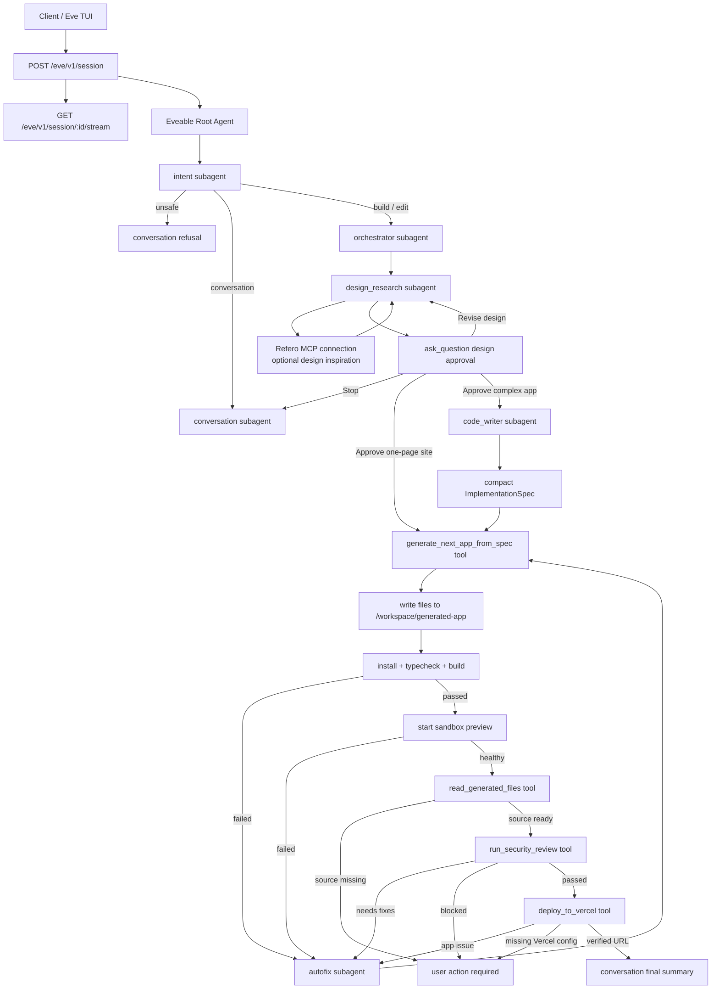

# "Build Whatever" by sixtyoneeighty - powered by Eve

"Build Whatever" by sixtyoneeighty - powered by Eve (Eveable) is an open-source alternative to Lovable built on Vercel Eve. It turns a prompt into a complete Next.js application, validates it in an Eve sandbox, starts a live preview, runs a security review, deploys to Vercel, and returns a verified deployment URL.

Eveable began as a standalone Eve-powered implementation of the existing `jaxagentsdk` builder pipeline. The NestJS `jaxagentsdk` remains untouched, so developers can compare the original architecture with a filesystem-first Eve implementation.

## Why Eveable

- **Built on Vercel Eve:** durable sessions, streamable runs, subagents, tools, human approval, and sandbox access come from Eve.
- **Real builder pipeline:** Eveable does not stop after writing files. It validates, previews, reviews, deploys, and verifies.
- **Open architecture:** each specialist is a folder under `agent/subagents/`, each integration is a typed Eve tool under `agent/tools/`.
- **Sandbox-first generation:** generated projects are written to `/workspace/generated-app`, not into the repository.
- **Refero-grounded design research:** the design research subagent can use Refero MCP for real visual references before approval.
- **Vercel deployment:** validated apps are deployed through `deploy_to_vercel` when `VERCEL_TOKEN` is configured.

## Current Version

Current release: `1.0.0`

The v1 release includes root orchestration, seven declared subagents, typed shared schemas, sandbox validation, preview health checks, Vercel deployment, CI, release packaging, and smoke tests.

## Architecture

Eve is filesystem-first: an agent is a directory of instructions, tools, channels, sandbox config, shared code, and subagents. Eveable follows that shape closely.



## Pipeline Guarantees

Eveable is intentionally strict about what counts as complete:

1. The root agent must call `intent` first for every user message.
2. Unsafe prompts are refused before builder subagents run.
3. Build prompts go through `orchestrator` and `design_research`.
4. `design_research` uses Refero MCP when configured, but continues with internal design judgment if Refero is unavailable.
5. Code generation pauses for user approval through Eve's `ask_question`.
6. Normal one-page websites use the deterministic `generate_next_app_from_spec` fast path.
7. Generated files are written only under `/workspace/generated-app`.
8. Finite quality commands run before any preview or deployment.
9. Source files are read back from the sandbox before security review.
10. Build, preview, security, and deployment failures route through `autofix` when repairable.
11. A final "ready" or "deployed" response is allowed only after:
   - quality commands pass
   - preview health check passes
   - security review passes
   - Vercel deployment returns and verifies a URL

## Repository Layout

```text
.
├── agent/
│   ├── agent.ts
│   ├── instructions.md
│   ├── channels/
│   │   └── eve.ts
│   ├── lib/
│   │   ├── model.ts
│   │   ├── sandbox.ts
│   │   └── schemas.ts
│   ├── sandbox/
│   │   └── sandbox.ts
│   ├── subagents/
│   │   ├── autofix/
│   │   ├── code_writer/
│   │   ├── conversation/
│   │   ├── design_research/
│   │   │   └── connections/
│   │   │       └── refero.ts
│   │   ├── intent/
│   │   ├── orchestrator/
│   │   └── security_review/
│   └── tools/
│       ├── deploy_to_vercel.ts
│       ├── read_generated_files.ts
│       ├── run_quality_commands.ts
│       ├── start_preview.ts
│       ├── write_generated_files.ts
│       ├── bash.ts
│       └── write_file.ts
├── scripts/
│   ├── package-release.sh
│   └── smoke.mjs
├── .github/workflows/
│   ├── ci.yml
│   └── release.yml
├── env.sample
├── CONTRIBUTING.md
├── SECURITY.md
└── README.md
```

## Key Files

| File | Purpose |
| --- | --- |
| `agent/instructions.md` | Root orchestration contract and completion rules. |
| `agent/agent.ts` | Root Eve model configuration. |
| `agent/lib/model.ts` | Role-based model selection through env vars. |
| `agent/lib/schemas.ts` | Zod schemas for structured handoffs and tool results. |
| `agent/lib/sandbox.ts` | Safe path handling, command normalization, redaction, and sandbox helpers. |
| `agent/sandbox/sandbox.ts` | Eve `defaultBackend()` sandbox setup. |
| `agent/channels/eve.ts` | Public Eve session/stream entrypoint. |
| `agent/subagents/design_research/connections/refero.ts` | Optional Refero MCP connection used only by the design research subagent. |
| `agent/tools/write_generated_files.ts` | Writes generated app files into `/workspace/generated-app`. |
| `agent/tools/run_quality_commands.ts` | Runs finite install/typecheck/build commands. |
| `agent/tools/start_preview.ts` | Starts preview, tries safe Next.js fallback commands, and verifies HTTP health inside the sandbox. |
| `agent/tools/read_generated_files.ts` | Reads generated source back from the sandbox for security review. |
| `agent/tools/run_security_review.ts` | Deterministically checks generated source for release-blocking security issues. |
| `agent/tools/deploy_to_vercel.ts` | Deploys the generated app to Vercel and verifies the URL. |
| `scripts/smoke.mjs` | Static project-shape checks used by CI. |

## Subagents

| Subagent | Responsibility |
| --- | --- |
| `intent` | Classifies the request, rejects unsafe work, and chooses the next route. |
| `conversation` | Writes user-facing chat, refusals, approval summaries, and final summaries. |
| `orchestrator` | Converts a safe build request into a concise internal plan. |
| `design_research` | Produces the approval-ready design direction and implementation brief. Uses Refero MCP for style and screen inspiration when configured. |
| `code_writer` | Generates a full Next.js TypeScript App Router project. |
| `autofix` | Repairs generated files after build, preview, security, or deployment failures. |
| `security_review` | Optional model-backed deeper review agent; the deploy gate uses `run_security_review` for deterministic structured output. |

## Tools

Eveable uses narrow local Eve tools instead of broad shell/file access:

| Tool | Scope |
| --- | --- |
| `write_generated_files` | Writes only safe relative paths under `/workspace/generated-app`. |
| `run_quality_commands` | Runs finite commands only. Preview/server commands are filtered out. |
| `start_preview` | Starts the generated app preview, falls back to known Next.js start/dev commands, and probes `http://127.0.0.1:<port>`. |
| `read_generated_files` | Reads generated source files from `/workspace/generated-app` before security review. |
| `deploy_to_vercel` | Runs Vercel CLI from the generated workspace and verifies the returned URL. |
| `search_unsplash_images` | CodeWriter-local image search using optional Unsplash credentials. |

`bash.ts` and `write_file.ts` are present as disabled broad tools. Keep them disabled unless you are intentionally changing the trust model.

## MCP Connections

Eveable v1 keeps MCP usage narrow. The only authored MCP connection is Refero,
and it is scoped to `agent/subagents/design_research/` so code generation,
autofix, deployment, and security review do not inherit it.

| Connection | Location | Purpose | Required env |
| --- | --- | --- | --- |
| `refero` | `agent/subagents/design_research/connections/refero.ts` | Search curated styles and real web UI screen references before design approval. | Optional `REFERO_API_KEY` or `REFERO_MCP_TOKEN` |

The design researcher asks Eve's `connection__search` for Refero tools, then
uses style references first and screen references only when the build needs a
concrete UI pattern. If Refero is missing, unauthenticated, or has no useful
matches, the subagent sets `referoMcpUsed=false` and continues without blocking
the build.

## Generated Code Location

Generated applications are stored in the Eve sandbox:

```text
/workspace/generated-app
```

The generated code is not written into this repository. To inspect it, watch the Eve stream/dev TUI tool results for:

- `write_generated_files`
- `run_quality_commands`
- `start_preview`
- `deploy_to_vercel`

Those results include the `sandboxId`, `workspacePath`, generated file list, command results, preview port, and Vercel deployment URL.

## Requirements

- Node.js `>=24 <27`
- pnpm `11.5.0`
- Vercel Eve `>=0.18.0`
- Vercel CLI available locally or installable through `npx`

## Environment

Copy `env.sample` to `.env.local`:

```bash
cp env.sample .env.local
```

Minimum local model setup:

```bash
AI_GATEWAY_API_KEY=...
```

Deployment setup:

```bash
VERCEL_TOKEN=...
```

Create a Vercel token from **Vercel Dashboard -> Account Settings -> Tokens**.
For local development, save it in `.env.local`:

```bash
VERCEL_TOKEN=...
VERCEL_SCOPE=your-team-or-username
VERCEL_PROJECT_NAME=eveable-generated-apps
```

`pnpm run dev` loads `.env.local` for Eveable, but your shell does not
automatically load it for direct CLI commands. If you want to run Vercel CLI
commands with the token from your terminal, source the file first:

```bash
set -a
source .env.local
set +a

vercel whoami --token "$VERCEL_TOKEN"
```

If `vercel whoami --token "$VERCEL_TOKEN"` says the token is missing, your shell
has not loaded `.env.local`; the file may still be correct.

To discover the correct scope:

```bash
vercel whoami
```

Use the active team slug or username as `VERCEL_SCOPE`. For example:

```bash
VERCEL_SCOPE=mordules-projects
```

Optional deployment controls:

```bash
VERCEL_PROJECT_NAME=...
VERCEL_SCOPE=...
EVEABLE_DEPLOY_ENV_ALLOWLIST=...
```

Optional generation integrations:

```bash
UNSPLASH_ACCESS_KEY=...
UNSPLASH_API_BASE_URL=https://api.unsplash.com

REFERO_MCP_URL=https://api.refero.design/mcp
REFERO_API_KEY=...
# or, if your secret is named this way:
REFERO_MCP_TOKEN=...

INSFORGE_API_BASE_URL=...
INSFORGE_API_KEY=...
```

Refero is used only for design inspiration in the `design_research` subagent.
Do not commit Refero keys. Put them in `.env.local` for local development or in
your deployed Eveable project environment.

`EVEABLE_ROOT_MODEL` replaces the older `MAYAR_ROOT_MODEL`; the runtime still accepts `MAYAR_ROOT_MODEL` as a fallback. `EVEABLE_DEPLOY_ENV_ALLOWLIST` replaces `MAYAR_DEPLOY_ENV_ALLOWLIST`; that older key is also still accepted as a fallback.

Never commit real `.env.local` values. Generated apps must not receive real secrets in source files or generated `.env.local` files.

## Model Configuration

"Build Whatever" can use different models per role.

| Role | Env var | Default |
| --- | --- | --- |
| Root | `EVEABLE_ROOT_MODEL` | `anthropic/claude-sonnet-5` |
| Intent | `INTENT_AGENT_MODEL` | `google/gemini-3.8-flash` |
| Orchestrator | `ORCHESTRATOR_AGENT_MODEL` | `anthropic/claude-fable-5.1` |
| Design Research | `DESIGN_RESEARCH_AGENT_MODEL` | `moonshotai/kimi-k3` |
| Code Writer | `CODE_WRITER_AGENT_MODEL` | `xai/grok-4.6` |
| Autofix | `AUTOFIX_AGENT_MODEL` | `zai/glm-5.3-flash` |
| Security Review | `SECURITY_REVIEW_AGENT_MODEL` | `anthropic/claude-opus-5` (explicit invocation only) |
| Conversation | `CONVERSATION_AGENT_MODEL` | `google/gemini-3.8-flash` |

Use Vercel AI Gateway model ids, including provider prefixes such as `anthropic/claude-sonnet-5`.
You can assign provider-specific models or overrides per role through the env vars above.

## Install

```bash
pnpm install --frozen-lockfile
```

## Run Locally

Start Eve in API server mode:

```bash
pnpm run dev
```

`pnpm run dev` starts Eve with `--no-ui`, hidden subagent streams, and collapsed
tool calls. That is the recommended mode for Eveable because the builder can
generate large source payloads and the interactive TUI can repaint those events
heavily. To use Eve's interactive terminal UI, run:

```bash
pnpm run dev:tui
```

To debug every child-agent payload and tool argument, use:

```bash
pnpm run dev:verbose
```

## How To Prompt Eveable

`pnpm run dev` runs Eveable in API server mode, so you do not type prompts into
the terminal that is running the server. Keep that terminal open, then send
messages from a second terminal, script, or UI client.

The local Eve API is available at:

```text
http://127.0.0.1:2000/eve/v1/session
```

Start a session from a second terminal:

```bash
curl -sS -X POST http://127.0.0.1:2000/eve/v1/session \
  -H "content-type: application/json" \
  -d '{"message":"Build a polished one-page website for a boutique plant shop called Moss & Circuit. Include a strong hero, featured plant cards, care tips, opening hours, a small gallery with realistic plant imagery, and a contact form. Make it responsive, modern, warm but not beige-heavy, and ready to preview and deploy."}'
```

The response includes a `sessionId` and `continuationToken`:

```json
{
  "continuationToken": "eve:...",
  "ok": true,
  "sessionId": "wrun_..."
}
```

Creating a session only starts the run and returns identifiers. It does not
print the event stream in the same terminal response. Use the returned
`sessionId` in a separate stream request:

```bash
curl -N http://127.0.0.1:2000/eve/v1/session/wrun_.../stream
```

The stream is newline-delimited JSON. For a more readable local view, pipe it
through `jq`:

```bash
curl -N http://127.0.0.1:2000/eve/v1/session/wrun_.../stream \
  | jq -c 'select(.type=="message.completed" or .type=="input.requested" or .type=="actions.requested" or .type=="action.result" or .type=="session.waiting")'
```

Stream a session:

```bash
curl -N http://127.0.0.1:2000/eve/v1/session/<sessionId>/stream
```

When the stream reaches the design approval checkpoint, approve the build with
the same `sessionId` and `continuationToken`:

```bash
curl -sS -X POST http://127.0.0.1:2000/eve/v1/session/<sessionId> \
  -H "content-type: application/json" \
  -d '{"continuationToken":"<continuationToken>","message":"Approve and build"}'
```

Then keep streaming the same session:

```bash
curl -N http://127.0.0.1:2000/eve/v1/session/<sessionId>/stream
```

If you prefer an interactive terminal prompt instead of API mode, run:

```bash
pnpm run dev:tui
```

API mode is the recommended default because Eveable can emit large tool and
subagent events during generation, validation, preview, security review, and
deployment.

If Eve dev reports stale workflow cache errors after edits, restart with a clean cache:

```bash
rm -rf .eve .output .workflow-data
pnpm run dev
```

The `dev`, `dev:tui`, and `dev:verbose` scripts already clear `.eve` and
`.output` before launching. They also clear `.workflow-data` so stale local
workflow runs cannot try to resume against a deleted Eve workflow cache.

## Test And Validate

Run everything CI runs:

```bash
pnpm run ci
```

Individual commands:

```bash
pnpm run audit
pnpm run typecheck
pnpm run build
pnpm run smoke
```

What they do:

- `audit`: critical production dependency audit
- `typecheck`: TypeScript validation with `tsgo`
- `build`: Eve discovery and production build
- `smoke`: static checks for expected files, model env mapping, and subagent-call discipline
- `ci`: audit, typecheck, build, and smoke

## Deployment Behavior

Generated app deployment happens from inside the Eve sandbox:

1. `deploy_to_vercel` runs in `/workspace/generated-app`.
2. It uses `VERCEL_TOKEN` from the Eveable runtime environment.
3. It passes selected server-only env vars through Vercel CLI `-e` and `-b` flags.
4. It parses the Vercel deployment URL.
5. It verifies deployment readiness with `vercel inspect`.

If `VERCEL_TOKEN` is missing, Eveable reports a blocked deployment with the exact configuration required. It does not invent deployment URLs.

When testing deployment manually, remember that `.env.local` is an application
env file, not a shell profile. Either start Eveable with `pnpm run dev`, which
loads it for the runtime, or source it before direct CLI tests:

```bash
set -a
source .env.local
set +a
vercel whoami --token "$VERCEL_TOKEN"
```

## Release Notes

### v1.0.0

- Introduced Eveable as an Eve-powered alternative to Lovable.
- Added durable session entrypoint through `/eve/v1/session` and `/eve/v1/session/:sessionId/stream`.
- Added multi-agent pipeline: intent, conversation, orchestrator, design research, code writer, autofix, and security review.
- Added human approval checkpoint before code generation through Eve's built-in `ask_question`.
- Added sandbox-first generated app writes under `/workspace/generated-app`.
- Added finite quality command validation, preview startup, preview health check, security review, Vercel deployment, and URL verification.
- Added role-based model selection with environment overrides.
- Added CI and release workflows for audit, typecheck, Eve build, smoke checks, packaging, artifact upload, and GitHub releases.
- Added optional Refero MCP design inspiration for the design research subagent.

## Release Workflow

The release workflow lives in `.github/workflows/release.yml`.

It supports:

- automatic releases when tags matching `v*` are pushed
- manual `workflow_dispatch` releases
- environment-specific packages: `development`, `staging`, or `production`
- source archive generation through `scripts/package-release.sh`
- GitHub release creation or update

Create a production release locally:

```bash
git tag v1.0.0
git push origin v1.0.0
```

The workflow packages the repository and uses this README as the release notes source.

## Contributing

Read `CONTRIBUTING.md` before opening issues or pull requests.

Good first contribution areas:

- improve generated app quality plans
- add safer deployment adapters
- improve design research guidance
- add tests around sandbox command normalization
- improve documentation for live Eve sessions

## Security

Read `SECURITY.md` before reporting vulnerabilities.

Important security expectations:

- never commit secrets
- never write real secrets into generated apps
- keep generated files constrained to `/workspace/generated-app`
- keep broad shell/file tools disabled by default
- treat deployment and external side effects as sensitive

## Known Limitations

- Eve is in preview, so public APIs can change.
- Live agent testing requires model credentials and can incur usage.
- Eveable intentionally keeps generated apps inside the sandbox unless the Vercel deployment tool succeeds.
- The current Eve/provider combination has had issues with optional subagent `outputSchema` in this workflow, so Eveable keeps shared Zod schemas for developers while asking subagents for JSON text through `message`.

## License

MIT. See `LICENSE`.
